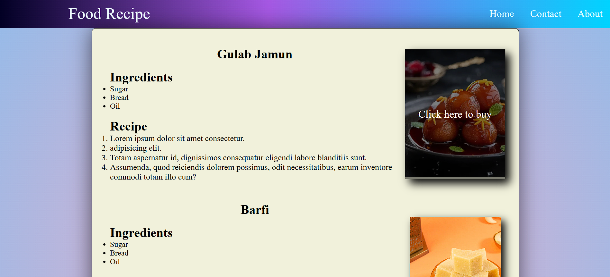

# Food Recipe Website

This is a simple **HTML and CSS** project that displays a food recipe webpage. It includes a stylish UI with a gradient header and recipe details for desserts like *Gulab Jamun* and *Barfi*.

## Features
- Responsive design with a visually appealing background.
- Recipe sections with images and descriptions.
- Navigation bar with links to Home, Contact, and About pages.

## Screenshot


## Technologies Used
- **HTML**: Structuring the webpage.
- **CSS**: Styling with gradients, box shadows, and layout designs.

## How to Run the Project
1. Clone the repository:
   ```sh
   git clone https://github.com/your-username/your-repo.git
   ```
2. Open the project folder and launch `index.html` in a browser.

## License
Free to use for learning purposes.
